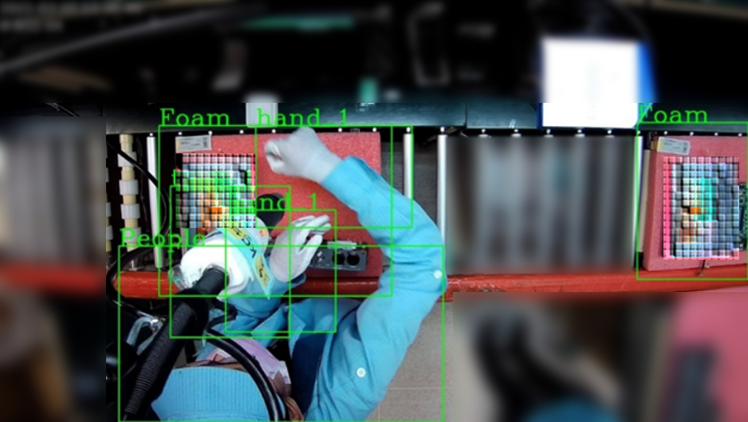

# DeviceOn-x86_Edge_AI_Solution
## Overview

A typical Machine Vision solution pipeline consists of data ingestion, data preprocessing, data labeling, model training and validation, model optimization, application development, application deployment and edge inference. Tasks and processes that could be ignored for POC purpose would become key success factors for production stage, such as  integrated pipeline from cloud training to edge inference, continuous deployment for AI application updates, remote monitoring, management over large-scale edge AI devices and further analytics of rich inference results. This best practice is to bridge those gaps with hand-on implementation details hopefully to bring every machine vision project to real edge production.

> ### **Architecture**

| Category  | Product | Key Benefits & Features |
| ------------- | ------------- | ------------- |
| ML SaaS | **[Azure Custom Vision](https://azure.microsoft.com/en-us/products/cognitive-services/custom-vision-service/)** | Easily customize your own state-of-the-art computer vision models for your **complex use case** that no ML expertise is required |
| Dev. Pipeline | [Azure DevOps](https://azure.microsoft.com/en-us/products/devops/) | Complete or complementary services provision to automate development pipeline for packaging your AI application and cross-region development|
| Deployment & Mgmt. | **[DeviceOn](https://campaign.advantech.online/en/DeviceOn/index.html#SolutionPackages)** | Central mgmt. platform to remotely update AI applications (OTA), and monitor and control large-scale devices at ease |
| AI Edge | **[EPC-B5587](https://www.advantech.com/en/products/f50cd471-773b-4301-95f4-5547702c0ec7/epc-b5587/mod_3cf5ef68-e055-45e1-98dd-84987ae4a331)** | A industrial grade AI edge of powerful computing performance equipped with a NVIDIA RTX-A6000 to deal with intricate AI algorithms |

> ### **Use Case**

In this repository, a real use case of factory assembly line AI is implemented from the beginning to the end. It demonstrates how Advantech supports customers to construct a production-stage edge AI solution with comprehensive software and hardware solutions. The factory operation manger wants to develop and adopt a vision AI solution to improve management efficiency and minimize production downtime with the two following specific objectives.

-	Wondering there is always a WIP at any station. 
-	Check if a station worker follows guidelines by wearing a cap and/or glove. 

> ### **Step-by-step details are presented in the following sections**

* #### [**ML | Label training data**](ML%20|%20Label%20training%20data.md)

* #### [**ML | Train an accurate enough AI model**](ML%20|%20Train%20an%20accurate%20enough%20AI%20model.md)

* #### [**DEV | Encapsulate a portable AI application**](DEV%20|%20Encapsulate%20a%20portable%20AI%20application.md)

* #### **DEV | Automate AI lifecycle** *(To be published soon, email wowaiot.wseg@advantech.com to get notified)*

* #### [**OPS | Deploy AI to any edge**](OPS%20|%20Deploy%20AI%20to%20any%20edge.md)

* #### **OPS | Collect data for re-training** *(To be published soon, email wowaiot.wseg@advantech.com to get notified)*

## Reference Resources

### Sample Data for Training and Inference

* [Images for labeling and training](https://advantecho365-my.sharepoint.com/:u:/g/personal/gary70_lin_advantech_com/Eap595EF6FJDplH1unr1bY8B-cv_BlD1m0fZ2k_96hPXfw?e=Z4GVbj)

* [Video for inference](https://advantecho365-my.sharepoint.com/:u:/g/personal/gary70_lin_advantech_com/Eap595EF6FJDplH1unr1bY8B-cv_BlD1m0fZ2k_96hPXfw?e=Z4GVbj)

### App Uploading and Deployment

* [Wrap an app](https://youtu.be/5wRANEF-nxM?t=171)

* [Select an app then deploy to devices](https://youtu.be/5wRANEF-nxM?t=15)

* [Select a device then deploy an app](https://youtu.be/5wRANEF-nxM?t=36)

### AI Model Deployment and Operation

* [Create a container](https://youtu.be/bilP6FpyU0M?t=109)

* [Container management](https://youtu.be/bilP6FpyU0M?t=145)

### [More about DeviceOn](https://docs.wise-paas.advantech.com/en/Guides_and_API_References/ApplicationServices/1564727799415968385/1564727878040194797/v1.0.2)
